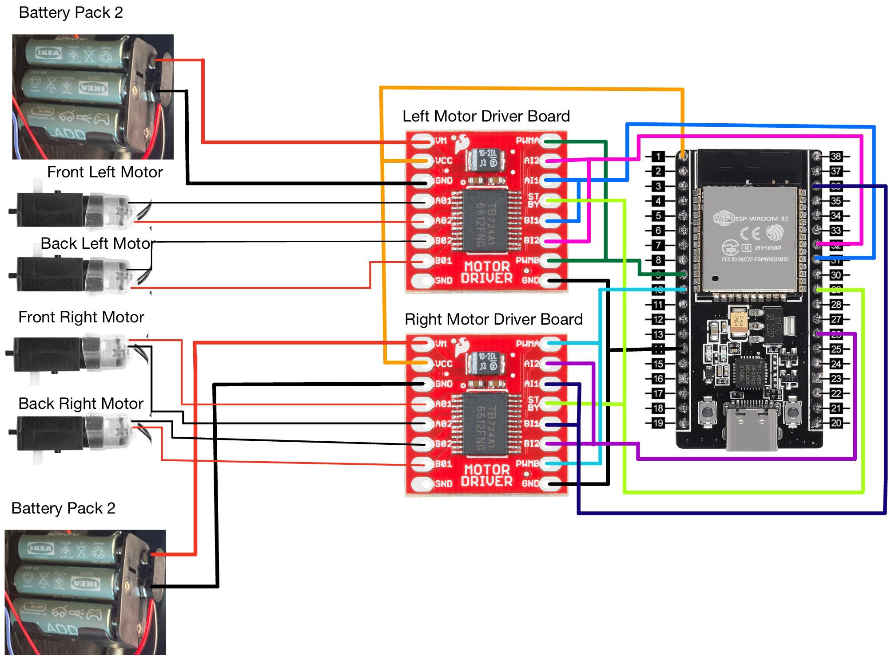
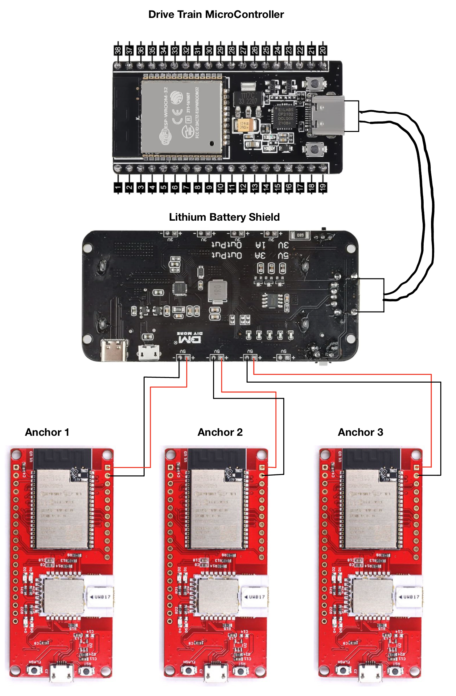
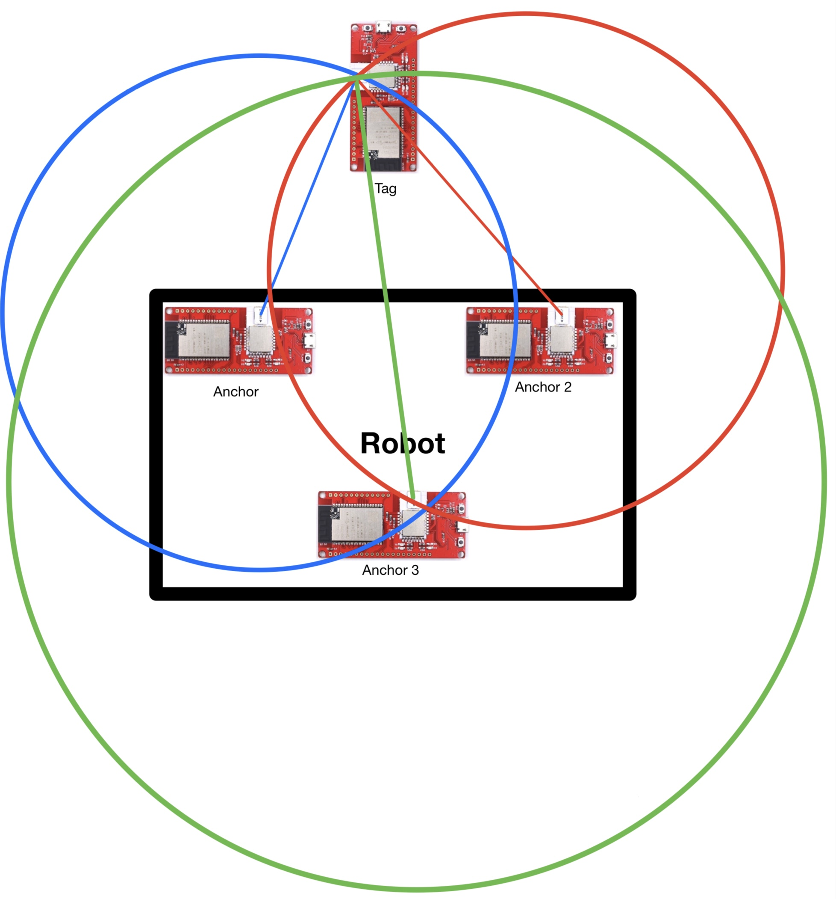

# Robot Tracking and Control System

- This repository contains the code and documentation for a robot tracking and control system. The project uses Ultra-Wideband (UWB) technology for precise localization and communication protocols like ESPNOW and Bluetooth to control the robot’s movement.

 ## J.A.T.S: Journeying Aid Transport System

## Project Overview

## Objective

- The robot is designed to continuously track a tag the user carries and adjust its position to ensure it always faces the tag and follows user. Additionally, an alternative control mode allows for direct manual operation of the robot using a Bluetooth-enabled application.

## Features

- Ultra-Wideband Tracking: Uses three anchors on the robot to calculate the distance to a tag for real-time trilateration.

- Autonomous Movement: Calculates and executes the required movement to keep the robot oriented towards the tag.

- ESPNOW Communication: Sends movement instructions from the main ESP32 microcontroller to the drivetrain ESP32 microcontroller.

- Bluetooth Control: An alternate version using the Dabble library enables manual control of the robot via Bluetooth.

## System Components

### Hardware

- Anchors: Three UWB modules positioned on the robot.

- Tag: A UWB module carried by the user.

- Microcontrollers: ESP32 boards for ldrivetrain control and communication via ESPNOW or Bluetooth.

- Drivetrain: Motors and motor drivers controlled by the drivetrain ESP32 microcontroller.

#### Drivetrain Design
 

#### MicroController Battery System
 

#### List of Materials
  -[UWB ESP32s](https://www.makerfabs.com/esp32-uwb-dw3000.html)
  -[NonUWB ESP32s](https://www.amazon.com/dp/B0B764963C?ref=ppx_yo2ov_dt_b_fed_asin_title&th=1)                         
  -[MicroUSB Data cables for DW3000 Programming](https://www.amazon.com/gp/product/B07QB6KL85/ref=ppx_od_dt_b_asin_title_s00?ie=UTF8&th=1)           
  -[V2 Robot Chassis with 4 motors](https://www.amazon.com/dp/B08LK1RDXM?ref=ppx_yo2ov_dt_b_fed_asin_title)                                          
  -[Battery Shield for lithium batteries](https://www.amazon.com/dp/B07SZKNST4?ref=ppx_yo2ov_dt_b_fed_asin_title&th=1)                                      
  -[2 18650 flat top lithium rechargeable batteries](https://www.amazon.com/dp/B0CRNSFQGX?ref=ppx_yo2ov_dt_b_fed_asin_title)                     
  -[3 pack TB6612FNG Motor Driver Module](https://www.amazon.com/dp/B08J3S6G2N?ref=ppx_yo2ov_dt_b_fed_asin_title)           
  -[Soldering Kit to solder components](https://www.amazon.com/dp/B08PZBPXLZ?ref=ppx_yo2ov_dt_b_fed_asin_title) 		      
  -[Battery Bank for anchor testing 3 usb A ports](https://www.amazon.com/dp/B0C147N71M?ref=ppx_yo2ov_dt_b_fed_asin_title)                        
  -[3 4-pack Ikea rechargeable 2450 mAh](https://www.ikea.com/us/en/p/ladda-rechargeable-battery-hr06-aa-1-2v-50504692/)    
  -[2 Ikea battery chargers](https://www.ikea.com/us/en/p/stenkol-battery-charger-50506525/)   
  -[2 6-Battery Holder](https://www.amazon.com/dp/B0858ZNNPK?ref=ppx_yo2ov_dt_b_fed_asin_title) 	      
  -[5 pack HC-SR04](https://www.amazon.com/dp/B01JG09DCK?ref_=ppx_hzod_title_dt_b_fed_asin_title_0_0&th=1) 			       
  -[M3*60MM Standoffs](https://www.amazon.com/dp/B09WHMMNLX?ref_=ppx_hzod_title_dt_b_fed_asin_title_1_0&th=1) 		                
  -[M3 Screw kit](https://www.amazon.com/gp/product/B08N5TJ2XV/ref=ox_sc_saved_title_1?smid=A2BPIUS9TNF8L5&th=1) 	        
  -[25 Foot Tape Measure](https://www.harborfreight.com/hand-tools/measuring-marking/tape-measures/25-ft-x-1-in-quikfind-tape-measure-with-abs-casing-69030.html) 		       
  -[Angle Finder](https://www.harborfreight.com/multi-purpose-angle-finder-57318.html) 				   

### Software
 

- Localization Algorithm: Implements trilateration to calculate the tag's position relative to the robot.
  
- Movement Algorithm: Determines the robot's movement to maintain alignment with the tag.

- ESPNOW Communication: Facilitates wireless communication between the main and drivetrain microcontrollers.

- Bluetooth Control: Uses the Dabble library for direct manual control of the drivetrain ESP32.

## Project Versions

### AutonomousESPNOWVersion
This version focuses on autonomous operation:

- Continuously calculates the tag's position using distances from the three anchors.

- Sends movement instructions via ESPNOW to the drivetrain ESP32.

- Suitable for autonomous tracking scenarios.

### Bluetooth Control

- This version allows manual operation:

- Uses the Dabble library for Bluetooth communication.

- Sends movement commands directly to the drivetrain ESP32 from a mobile device.

- Ideal for scenarios requiring direct manual control.

## Why Separate Versions?

- Due to program space limitations on the drivetrain ESP32, the ESPNOW-based tracking system and the Bluetooth control system are maintained as separate versions.

## Getting Started

### Hardware

- ESP32 microcontrollers.

- ESP32 UWB modules from makerfabs

- Motor driver boards TB6612FNG and motors for the drivetrain.

### Software

- Dabble app for Bluetooth control (optional).

## Installation

Install the necessary modified libraries:

- DW3000

- DabbleESP32 (for Bluetooth version).

Upload the respective code to the ESP32 microcontrollers.

## Usage

UWB Tracking

- Power on the robot and the tag.

- The robot will automatically calculate the tag's position and adjust its orientation.

Bluetooth Control

- Pair your mobile device with the drivetrain ESP32 via Bluetooth.

- Open the Dabble app and use the control interface to operate the robot manually.

Contributing

Contributions are welcome! Please create a pull request or open an issue to suggest changes or report bugs.

License

This project is licensed under the MIT License. 

Acknowledgments

Special thanks to the developers of the Dabble library and ESPNOW communication protocol for enabling this project.

Feel free to reach out with questions or suggestions by opening an issue on this repository.

